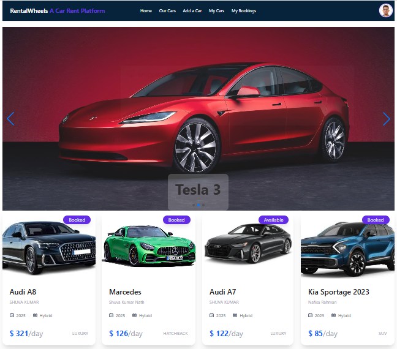

# 🌍 Car Rent Service Platform

## 📌 Project Overview
A modern and responsive web application built to showcase car rental services for daily life uses.

## 🚀 Live Demo
🔗 https://car-rental-platform-skn143.web.app

## 🖼 Screenshot


## 🛠 Technologies Used
- React.js
- Tailwind CSS
- JavaScript

## ✨ Core Features
- Responsive UI for all devices
- Dynamic data rendering
- User-friendly navigation
- Clean and modern design

## 📦 Dependencies
- react
- react-router-dom
- axios
- tailwindcss

## 🔗 Resources
Live Site: https://car-rental-platform-skn143.web.app
GitHub Repo: https://github.com/shuvakumar143/Assignment-10-Server-PH-SKN.git

## ⚙ How to Run Locally
Clone the repository
```bash
git clone https://github.com/shuvakumar143/Assignment-10-Server-PH-SKN.git
npm install
npm run dev
Run: http://localhost:5173

